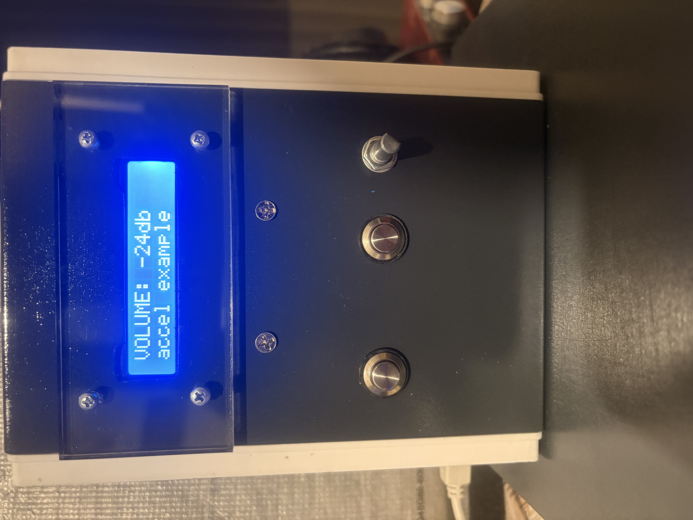
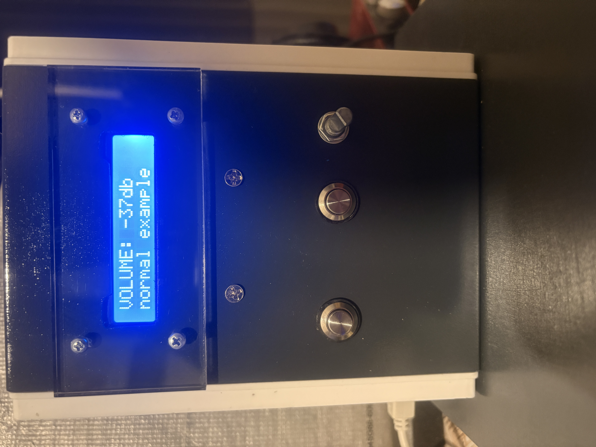

# AmiraEncoder

Rotary encoder library with acceleration support. 
AmiraEncoder allows developers to use the rotary encoder with acceleration support to speed up the increment of the variable. 

---

## ✨ Features

- ✔️ Reliable direction detection (CW / CCW) 
- ✔️ Automatic acceleration based on rotation speed 
- ✔️ Configurable normal step and accelerated step
- ✔️ Bounce-resistant thanks to state-table logic (developed by Brian Low)
- ✔️ Supports internal or external pull-up resistors
- ✔️ Clean and beginner-friendly API
- ✔️ Pure full-step decoding (no half-step noise)

---

## 📦 Installation

### **🟢 Method 1 — Arduino IDE Include Library **
Download the .zip from GitHub -> *Sketch -> Include Library -> Add .ZIP Library*.

### **⚪ Method 2 — Arduino IDE Include Library **
Open Library Manager on left column of Arduino IDE -> search "AmiraEncoder" -> select and install.

### **🔵 Method 3 — Manual Installation **
Copy the **AmiraEncoder** folder into: ~/Documents/Arduino/libraries.

## 📕 User guide
Three examples to learn how to use the library. Enjoy!😎

## ⚙️ Requirements

Arduino compatible board, 
I2C LCD based on PCF8574 or compatible, 

## 👤 Author

Developed by Livio Bellini. 
Inspiration: Amira F. - "You shine like a neutron star".⭐

## ⭐ Support the project

Leave a star ⭐ on GitHub if you find AmiraEncoder useful!

## 📸 Images

