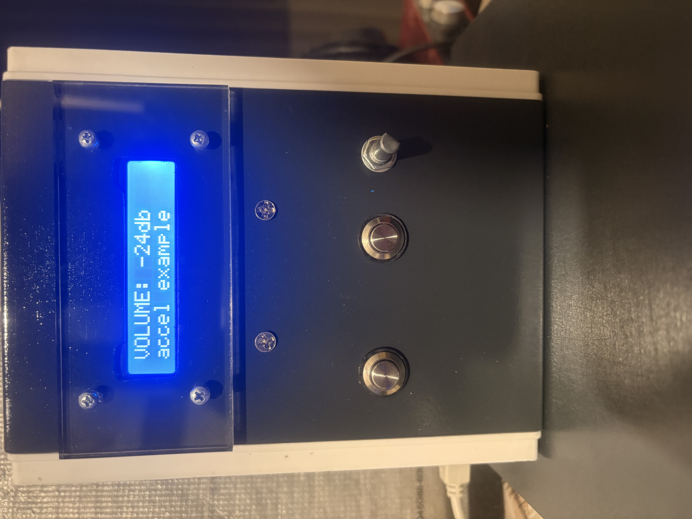
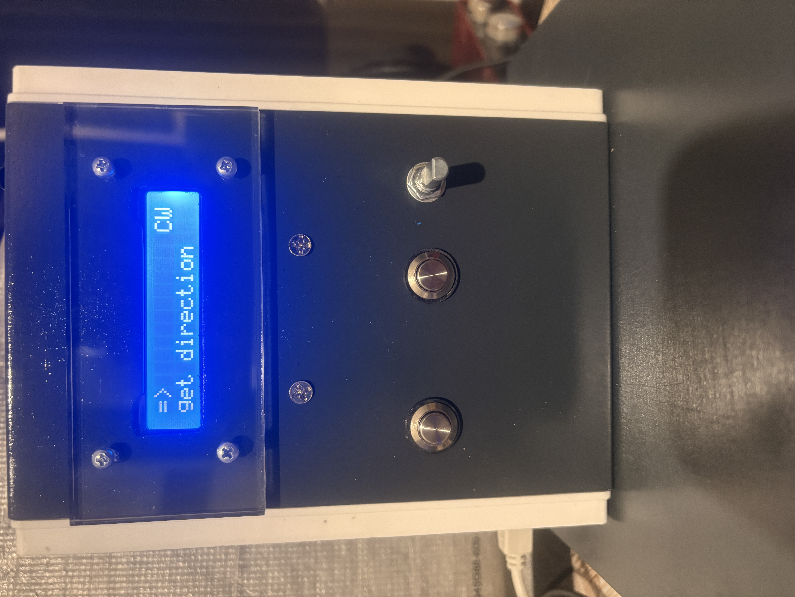
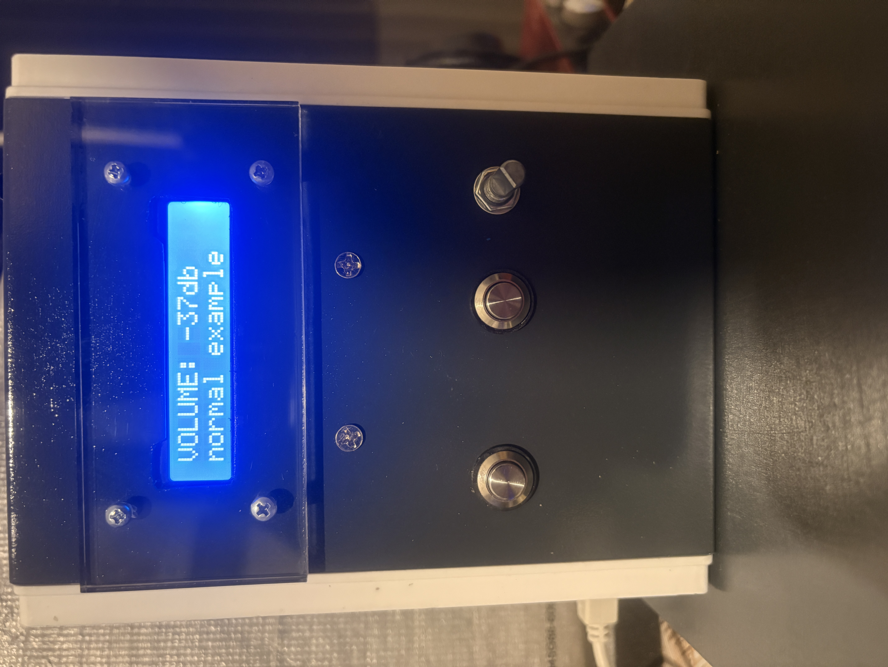

# AmiraEncoder

Rotary encoder library with acceleration support. 
AmiraEncoder allows developers to use the rotary encoder with acceleration support to speed up the increment of the variable. 

---

## ✨ Features

- ✔️ Reliable direction detection (CW / CCW) 
- ✔️ Automatic acceleration based on rotation speed 
- ✔️ Configurable normal step, accelerated step and encoder sensitivity
- ✔️ Integrated variable increment/decrement logic
- ✔️ Bounce-resistant thanks to state-table logic (developed by Brian Low)
- ✔️ Selectable full step and half step table in constructor.
- ✔️ Supports internal or external pullup resistors
- ✔️ Clean and beginner-friendly API

---

## 📦 Installation

### **🟢 Method 1 — Arduino IDE Include Library **
Download the .zip from GitHub -> *Sketch -> Include Library -> Add .ZIP Library*.

### **⚪ Method 2 — Arduino IDE Include Library **
Open Library Manager on left column of Arduino IDE -> search "AmiraEncoder" -> select and install.

### **🔵 Method 3 — Manual Installation **
Copy the **AmiraEncoder** folder into: ~/Documents/Arduino/libraries.

## 📕 User guide

- ✔️ If you want to use half step rotary encoder table then you have to declare "#define HALF_STEP" before including "#include <AmiraEncoder.h>". 
- ✔️ Use setStep to set the normal step value and use setAccel to set the accelerated step value. 
- ✔️ If you don't use these functions then default values will be 1 for normStep and 0 for longStep. 
- ❗❗ In setAccel use always a value greater than the value used in setStep. 
- ✔️ Call name.setAccel(0); when you want to disable acceleration. 
- ✔️ Call name.setStep(1); when you want to reset the normal step to 1 (default). 
- ✔️ Encoder::name(DT, CLK, EXTERNAL, 25, HALF_STEP); <= This is the right way to declare encoder object with external pullup resistors and 25 as sensitivity. 
- ✔️ If you don't declare EXTERNAL then it will be INTERNAL as default for pullup resistors. 
- ✔️ If you don't write a value for sensitivity in object parameters then it will be 0 as default, I like using 25 sensitivity. 
- ✔️ If you don't declare HALF_STEP then it will be FULL_STEP as default for step mode table. 
- ❗❗ If sensitivity is equal to 0 and longStep is equal to 0 then the acceleration is inhibited. 
- ❗❗ AmiraEncoder return a long type (int32_t), to prevent overflow error do not use AmiraEncoder to change unsigned type variables.

Three examples to learn how to use the library. Enjoy!😎

## 🙂 About half step and full step mode

- ✔️ HALF_STEP  event also generated on intermediate states (11):
- very precise, more sensitive to bounce, double theoretical resolution, suitable for high-quality encoders.
- ✔️ FULL_STEP event generated only when the encoder reaches the mechanical detent (typically 00):
- very stable, less sensitive to bounce, low precision than half step, suitable for low-cost encoders. 

## ⚙️ Requirements

Arduino compatible board. 

## 👤 Author

Developed by Livio Bellini. 
Inspiration: Amira F. - "You shine like a neutron star".⭐

## ⭐ Support the project

Leave a star ⭐ on GitHub if you find AmiraEncoder useful!

## 📸 Images

